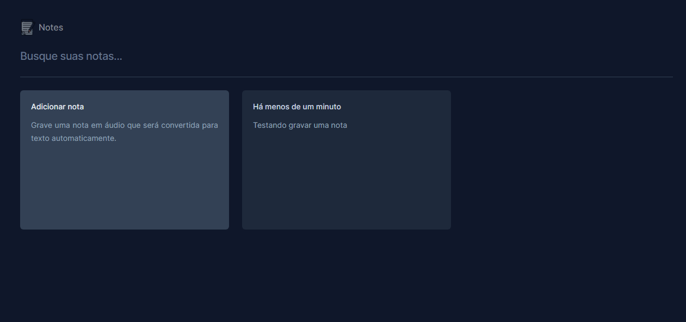
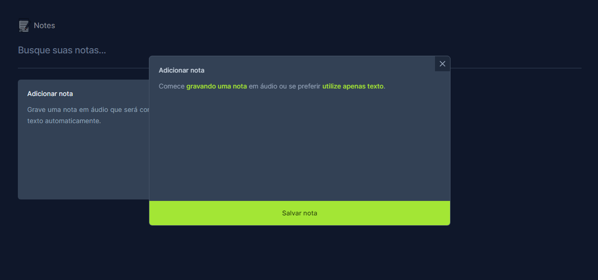
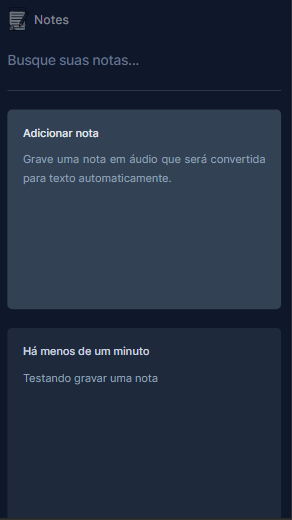
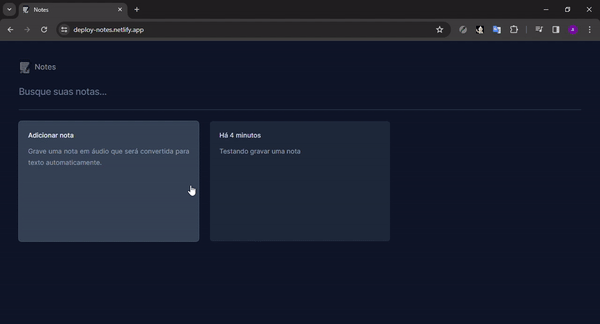

## 🖥 Desktop

## 📱 Mobile

## 📌 Sobre

**Notes** é um projeto para pesquisa de armazenamento de notas, onde é possivel usar a api do navegador para transformar áudio em texto.

## 🚀 Tecnologias utilizadas

O projeto foi desenvolvido utilizando as seguintes tecnologias:

- [Vite](https://vitejs.dev/)
- [Typescript](https://www.typescriptlang.org/)
- [Tailwindcss](https://tailwindcss.com/)
- [Date-fns](https://date-fns.org/)
- [Sonner](https://sonner.emilkowal.ski/)

## 💻 O projeto pode ser vizualizado acessando o seguinte link

<https://deploy-notes.netlify.app/>

## 👀  Exemplo

